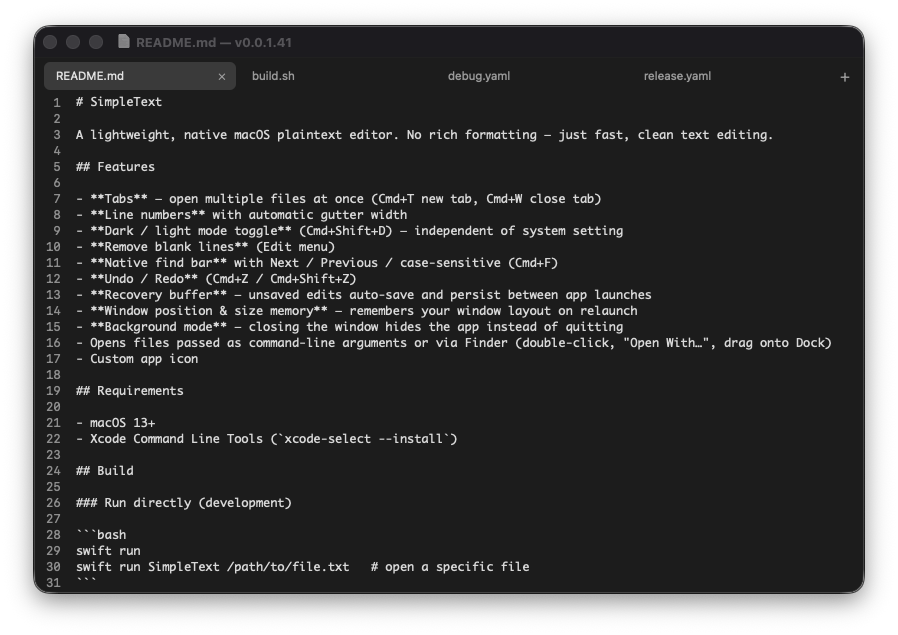

# SimpleText

A lightweight, native macOS plaintext editor. No rich formatting — just fast, clean text editing.



## Features

- **Tabs** — Cmd+T new tab, Cmd+W close tab; drag to reorder; right-click for "Close Tabs to the Right" / "Close Other Tabs"; closing the last tab opens a fresh blank tab (window stays open)
- **Line numbers** with automatic gutter width
- **Dark / light mode toggle** (Cmd+Shift+D) — independent of system setting
- **Remove blank lines** (Edit menu)
- **Syntax highlighting** — VS Code Dark+/Light+ color scheme for Swift, Python, JavaScript, TypeScript, JSON, HTML, CSS, Bash, Go, Rust, Java, Ruby, YAML, PowerShell, and more; Markdown uses a dedicated regex highlighter for accurate inline rendering
- **Native find bar** with Next / Previous / case-sensitive / Replace (Cmd+F)
- **Font size zoom** (Cmd+= / Cmd+-) — persists across launches
- **Status bar** — version number (bottom-left), live line/column/word/character count (bottom-right)
- **Print** (Cmd+P)
- **Undo / Redo** — word-boundary granularity (one undo step per word), isolated per tab
- **Session recovery** — all open tabs (unsaved or modified) persist between app launches, restoring your exact tab layout and content
- **Window position & size memory** — remembers your window layout on relaunch
- **Background mode** — closing the window hides the app instead of quitting
- Opens files via command-line arguments, Finder (double-click / "Open With…"), drag onto Dock icon, or drag-and-drop directly into the app window

## Keyboard Shortcuts

| Action | Shortcut |
|--------|----------|
| New Tab | Cmd+T |
| Open… | Cmd+O |
| Save | Cmd+S |
| Save As… | Cmd+Shift+S |
| Close Tab | Cmd+W |
| Undo | Cmd+Z |
| Redo | Cmd+Shift+Z |
| Cut | Cmd+X |
| Copy | Cmd+C |
| Paste | Cmd+V |
| Select All | Cmd+A |
| Find… | Cmd+F |
| Find Next | Cmd+G |
| Find Previous | Cmd+Shift+G |
| Toggle Dark Mode | Cmd+Shift+D |
| Zoom In | Cmd+= |
| Zoom Out | Cmd+- |
| Reset Zoom | Cmd+0 |
| Print… | Cmd+P |
| Quit | Cmd+Q |

## Usage Notes

**Background mode:** Clicking the red X hides the window — the app keeps running in the Dock. To fully quit, use Cmd+Q or SimpleText → Quit SimpleText.

**Session recovery:** All tabs (saved and unsaved) are automatically persisted to `~/Library/Application Support/SimpleText/session.json` and restored on next launch. The selected tab index is also restored. Use Edit → "Clear Unsaved Buffer" to wipe the recovery state if needed.

**Save prompts:** When closing a tab (Cmd+W) or using "Close Tabs to the Right" / "Close Other Tabs", you'll be prompted to save if the tab has a named file with unsaved changes, or if an untitled tab has content. Empty or clean tabs close without a prompt. Cmd+Q prompts for all unsaved named files before quitting.

**Undo:** Each tab has its own isolated undo stack. Undo steps at word boundaries — each word is a single undo step, matching TextEdit behavior.

## Installation

1. [Build the app](#building-from-source) or download a release
2. Drag `SimpleText.app` to `/Applications`
3. Launch from Finder or Spotlight

## Requirements

- macOS 13+
- Xcode Command Line Tools (`xcode-select --install`) — for building from source only

## Building from Source

### Run directly (development)

```bash
swift run
swift run SimpleText /path/to/file.txt   # open a specific file
```

### Build a .app bundle

```bash
./build.sh
open build/SimpleText.app
```

The `.app` is written to `build/SimpleText.app`. You can drag it to `/Applications`.

### Open in Xcode

```bash
open Package.swift
```

## Architecture

Built with **Swift + AppKit**, structured for future cross-platform portability:

| File | Role |
|------|------|
| `TextEngine.swift` | Pure Swift text logic — no AppKit, portable to other platforms |
| `RecoveryBuffer.swift` | Auto-saves full session (all tabs) to `~/Library/Application Support/SimpleText/session.json` |
| `EditorView.swift` | `NSScrollView` + `NSTextView` with `LineNumberRulerView` as a sibling view; intercepts file-URL drags to open in a new tab instead of inserting text |
| `LineNumberRulerView.swift` | Custom `NSView` line number gutter with dynamic width; sibling to the scroll view |
| `TabBarView.swift` | Chrome-style tab bar with pill-shaped active tabs; drag-to-reorder with animation; right-click context menu |
| `TabController.swift` | Manages multiple editor tabs; routes Finder file opens without losing current work; prompts to save on close (named files and untitled buffers with content); bulk close ("Close Tabs to the Right" / "Close Other Tabs") processes tabs one at a time |
| `DocumentController.swift` | File I/O (open, save, new) and recovery buffer integration |
| `AppearanceManager.swift` | Dark / light mode toggle via `window.appearance` override |
| `EditorViewController.swift` | Central coordinator; owns UI subviews and handles menu actions |
| `WindowController.swift` | Window lifecycle; hides on close (background mode) |
| `AppDelegate.swift` | App lifecycle and programmatic menu bar construction |
| `SyntaxHighlighter.swift` | Markdown syntax highlighting (regex-based, VS Code–matched colors); uses `NSLayoutManager` temporary attributes (not undo-tracked) |
| `HighlightCoordinator.swift` | Wraps Neon's `TextViewHighlighter` for Tree-sitter–based syntax highlighting of all non-Markdown languages |
| `LanguageRegistry.swift` | Maps file extensions to lazily-loaded `LanguageConfiguration` objects (15+ languages) |
| `HighlightTheme.swift` | Maps tree-sitter capture names to VS Code Dark+/Light+ colors |
